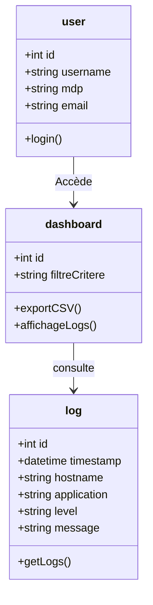

```mermaid
classDiagram
    class user {
        +int id
        +string username
        +string mdp
        +string email
        +login()
    }

    class dashboard{
        +int id 
        +string filtreCritere
        +exportCSV()
        +affichageLogs()
    }

    class log {
        +int id
        +datetime timestamp
        +string hostname
        +string application
        +string level
        +string message
        +getLogs()

    }

    user --> dashboard : Accède
    dashboard --> log : consulte
```