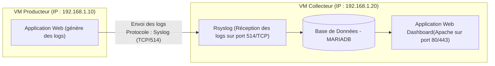

```mermaid
flowchart LR
    subgraph Producteur ["VM Producteur (IP : 192.168.1.10)"]
        AppWeb["Application Web (génère des logs)"]
    end

    subgraph Collecteur ["VM Collecteur (IP : 192.168.1.20)"]
        Rsyslog["Rsyslog (Réception des logs sur port 514/TCP)"]
        DB[(Base de Données - MARIADB)]
        Dashboard["Application Web Dashboard(Apache sur port 80/443)"]
    end

    AppWeb -- "Envoi des logs\nProtocole : Syslog (TCP/514)" --> Rsyslog
    Rsyslog --> DB
    DB --> Dashboard
```